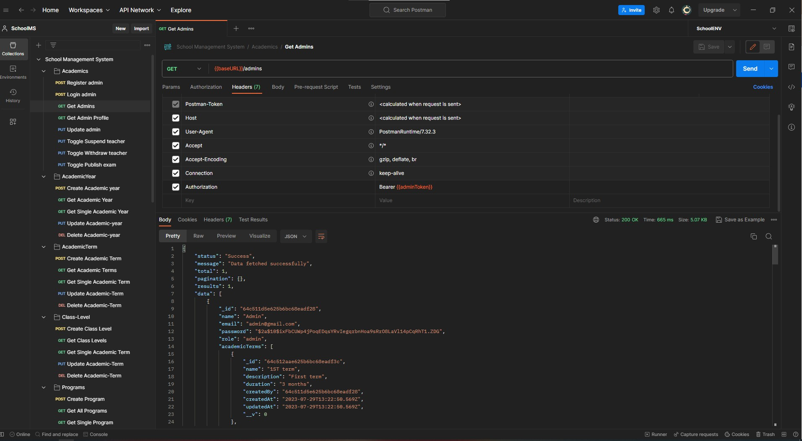

# School Management System

### Description
This project is a school management system built with Node.js and MongoDB. It allows admins to create and manage teachers and students, and to toggle restrictions on teachers. Teachers can create exams with questions for students and etc...

#### The project is divided into three main components:

Models: The models represent the different entities in the system, such as admins, teachers, students, exams, and questions.
Controllers: The controllers handle the HTTP requests for the different models.
Middlewares: The middlewares provide additional functionality, such as authentication, authorization, and error handling.
The project is designed to be scalable and extensible. It uses a modular architecture that makes it easy to add new features or change existing ones.

#### Here are some features of the project:

Admins: Admins can create and manage teachers and students. They can also toggle restrictions on teachers.
Teachers: Teachers can create exams with questions for students. They can also view the results of exams.
Students: Students can view their exam results and take exams.
The project is still under development, but it is a good starting point for building a school management system.

#### Testing:
The API has been tested using Postman. The tests cover all of the main features of the API, including authentication, authorization, and error handling.

